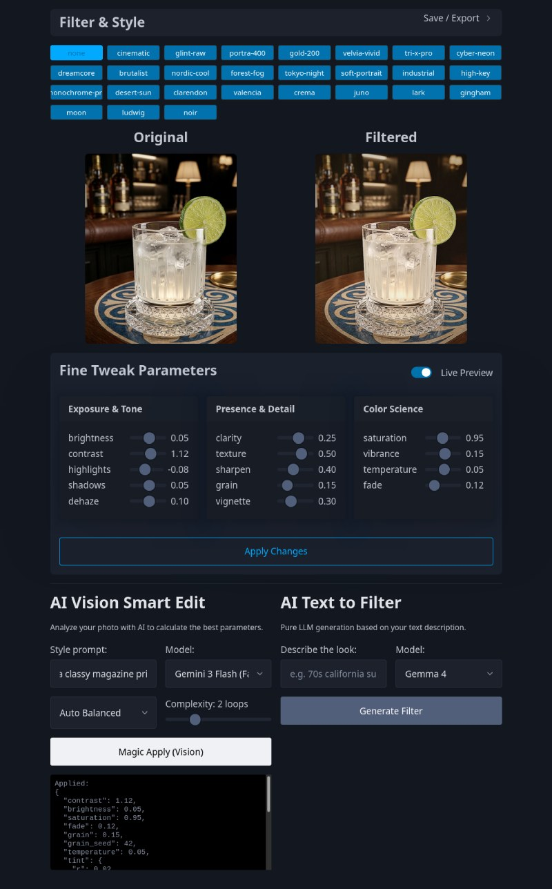

# Glint

Traditional image filtering meets iterative vision-guided styling. **Glint** is an image processing pipeline that combines functional color science with iterative AI refinement.

<p align="center">
  
  <br>
  <em>The Glint editor interface featuring AI-driven photo enhancement and manual parameter controls.</em>
</p>

## Key Features

- **Iterative Vision Loops**: Uses Gemini/Gemma to analyze photos and calculate filter parameters over discrete refinement rounds. It evaluates the image and adjusts accordingly.
- **Prompt-to-Filter**: Describe a look (e.g., "70s moody film grain") and have an LLM derive the underlying color parameters.
- **Functional Core**: Image transformations built on NumPy and PIL—deterministic, testable, and side-effect free.
- **The URL is the Source of Truth**: Slider moves and AI suggestions are encoded in the query string. Deep links work, and browser history is preserved.
- **Universal Presets**: Save combinations of AI and manual tweaks as persistent presets or export as standard `.cube` 3D LUTs for external editors.
- **Smart Portability**: Download looks as `.json` files or drag-and-drop them onto the workbench to instantly apply a style.
- **LUT Import**: Apply 3D LUTs (including S-Log3 support) via the advanced import accordion.
- **Pragmatic UX**: A minimalist Pico CSS interface with clipboard support and a "Super Response" live-preview toggle.

## Quick Start (Nix)

Glint is designed for modern development with [Nix Flakes](https://wiki.nixos.org/wiki/Flakes).

```bash
# Enter the developer shell
nix develop

# Start the Web UI
nix run . -- serve

# List available filters via CLI
nix run . -- list

# AI Auto-fix an image via CLI
nix run . -- auto-fix input.jpg output.png --rounds 3 --focus pop
```

## CLI Usage

- `glint list`: List all built-in and custom filters.
- `glint apply <filter> <input> -o <output>`: Apply a preset to an image.
- `glint generate "<prompt>"`: Create a new filter definition from a description.
- `glint export <filter> -o <output>.cube`: Export a look for use in professional editing software.
- `glint serve`: Launch the interactive visual workbench.

## Architecture: Functional Core, Imperative Shell

Glint follows a strict boundary between logic and IO:

1. **Functional Core (`core.py`)**: Pure functions that transform images. No side effects.
1. **Calculations (`pipeline.py`)**: The "brain" for merging, blending, and validating parameter sets.
1. **Imperative Shell (`server.py`, `cli.py`)**: Handles the outside world—FastAPI, local file I/O, and calls to the vision gateway via the `prism` proxy.

## Development & Testing

Stability is prioritized over clever abstractions.

```bash
# Run the test suite
pytest

# Lint and Format
ruff check .
ruff format .
```

## License

MIT
